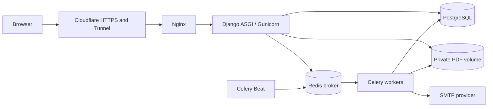
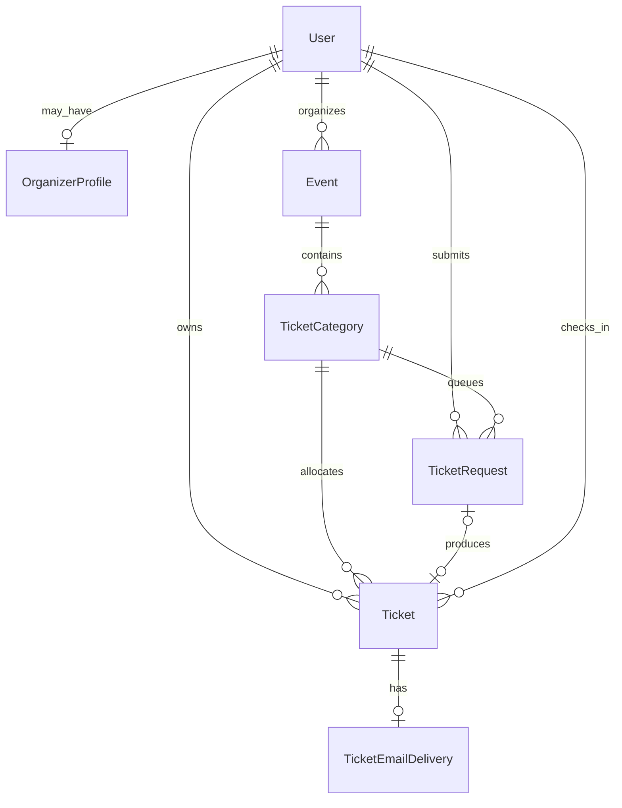

# Hack TUES Ticketing Platform: Project Guide

This guide explains what the project does, how its parts cooperate,
why the important architectural choices were made, and how to develop,
test, deploy, operate, and extend it.

## 1. What the application is

Hack TUES Tickets is a self-hosted, multi-event ticketing platform. It
supports attendee accounts, verified-email ticket eligibility,
organizer-managed events, durable fair ticket allocation, PDF tickets,
email delivery, QR check-in, and live availability.

The simulated purchase does not charge money. A successful request
immediately creates a free ticket after it reaches the front of the
queue.

Implemented assignment requirements:

- public landing and event pages;
- manual registration and Google login;
- mandatory verified email before ticket issuance;
- limited ticket inventory and per-user limits;
- durable, ordered purchase requests;
- atomic allocation that cannot oversell a category;
- live availability without a full-page reload;
- downloadable PDF tickets;
- ticket PDF delivery by email;
- organizer event management;
- QR-based, one-time admission check-in;
- responsive light and dark themes;
- public Docker deployment behind Nginx and Cloudflare.

The one intentional deviation from the assignment is file storage.
PDFs currently live on the VM in a private Docker volume, not in a
cloud object-storage service. This is suitable for the project demo,
but does not literally satisfy the assignment's cloud-storage wording.
An off-VM backup script is still an operational requirement.

## 2. System architecture

The code is a modular Django monolith. The web interface and HTTP API
are one Django application, while background work is performed by
Celery workers using the same code and database.



The main architectural rule is that PostgreSQL is authoritative:

- ticket availability is calculated from active ticket rows;
- queue order is stored in `TicketRequest` rows;
- idempotency is enforced by unique database constraints;
- ticket, check-in, PDF metadata, and email-delivery state are durable;
- Redis is never used as the inventory counter.

This means losing Redis may delay work, but cannot lose an accepted
request, invent a ticket, or change the true availability.

### Runtime services

| Service | Responsibility | Persistent data |
|---|---|---|
| `postgres` | Users, events, queue, tickets and delivery state | `postgres_data` volume |
| `redis` | Celery broker and task transport | `redis_data` volume with AOF |
| `web` | Django views, authentication, JSON endpoints and downloads | Reads/writes PostgreSQL and private PDFs |
| `worker` | Queue allocation, PDF generation and email sending | Reads/writes PostgreSQL and private PDFs |
| `beat` | Periodic recovery scans for pending work | Schedule file is disposable |
| `nginx` | Static files, reverse proxy and access-log redaction | `static_data` is generated |

## 3. Repository map

```text
.
├── compose.yaml                 Container topology and volumes
├── Dockerfile                  Python 3.13 production image
├── pyproject.toml              Python dependencies and tool settings
├── uv.lock                     Reproducible dependency lock
├── .env.example                Configuration template; never add .env
├── README.md                   Project summary and checklist status
├── docs/
│   └── PROJECT_GUIDE.md        This detailed guide
├── deploy/
│   ├── README.md               Production and Cloudflare runbook
│   ├── gunicorn.conf.py        ASGI worker configuration
│   ├── nginx/ticketing.conf    Reverse proxy and redacted logging
│   └── scripts/start-web.sh    Development/production web entrypoint
└── src/
    ├── manage.py
    ├── config/                 Settings, root URLs, ASGI and Celery
    ├── apps/
    │   ├── accounts/           Users, verification and organizers
    │   ├── events/             Events, categories and management
    │   └── tickets/            Queue, allocation, PDFs, email and check-in
    ├── templates/              Django HTML and email templates
    └── static/                 CSS, JavaScript, icons and vendor assets
```

### Application boundaries

`apps.accounts`

- custom email-based user model;
- manual signup, login and mandatory verification through allauth;
- Google OAuth configuration;
- profile management and protected account deletion;
- organizer-access requests and approval state.

`apps.events`

- event and ticket-category models;
- public event list and detail pages;
- live availability JSON endpoint;
- organizer create, edit, publish, cancel and draft-delete workflows.

`apps.tickets`

- durable purchase-request queue;
- transactional allocation, cancellation and check-in services;
- ticket and delivery models;
- PDF rendering and private storage;
- QR generation and validation URLs;
- background ticket-email delivery and recovery tasks.

`config`

- environment-based Django configuration;
- root URL routing;
- ASGI/WSGI entrypoints;
- Celery application and periodic schedules;
- deployment health endpoint.

## 4. Data model



### `User`

The custom user model removes usernames and uses a unique, normalized
email as the login identifier. Passwords use Django's password hashing.
The separate allauth `EmailAddress` record is the authority checked for
ticket eligibility. `email_verified_at` is maintained as compatible
audit metadata, but business logic checks the matching verified
allauth record.

### `OrganizerProfile`

An organizer request has `pending`, `approved`, or `rejected` status.
Only approved organizers may access event management. An organizer may
modify only events where `Event.organizer` is their user account.

### `Event`

Important fields are name, slug, venue, description, start/end times,
registration window, organizer and status.

Event states:

- `draft`: visible only to its organizer/admin and still editable;
- `published`: publicly visible and potentially open for registration;
- `cancelled`: publicly visible, but ticket registration/check-in is closed;
- `completed`: historical public event with registration closed.

### `TicketCategory`

Each event can have multiple categories such as Standard or VIP. A
category defines capacity, per-user limit, display order, active flag,
and optional registration-window overrides. Empty overrides inherit the
event's window.

Availability is:

```text
max(category.capacity - active ticket count, 0)
```

Only `issued` and `checked_in` tickets count against capacity.
Cancelled tickets do not.

### `TicketRequest`

This is the durable queue record. Its integer primary key is the queue
sequence, while `public_id` is the opaque identifier placed in the
owner-only status URL. The UUID `idempotency_key` prevents a repeated
browser POST from creating another request.

Queue states:

- `pending`: waiting for its category worker;
- `succeeded`: produced exactly one linked ticket;
- `rejected`: completed without a ticket and stores a safe failure code/message.

Database constraints ensure each state has consistent ticket, error,
and completion fields.

### `Ticket`

The ticket UUID is its public ticket identifier. Its separate 256-bit
URL-safe validation token is used in the QR check-in URL.

Ticket states:

- `issued`: valid, not yet admitted;
- `checked_in`: admitted once and still counts against capacity;
- `cancelled`: invalid and releases capacity.

The model also stores PDF storage metadata and check-in audit fields.
Database constraints prevent inconsistent combinations such as a
checked-in ticket without a checker or timestamp.

An owner may assign an optional 80-character display name from My
Tickets. This is a convenience label and safe download filename; it
does not change the event, category, ticket identity, QR token, or
private storage path.

### `TicketEmailDelivery`

Every newly issued ticket creates a delivery record in the same
transaction. States are `pending`, `sending`, `sent`, `failed`, and
`cancelled`. Attempt timestamps, counts, error text and a stable message
token make delivery retryable and auditable.

## 5. Authentication and authorization

### Manual registration

1. A visitor submits email, password and profile fields.
2. django-allauth creates the user and sends a confirmation email.
3. The confirmation link verifies the matching `EmailAddress`.
4. The user can log in before verification, but cannot receive a ticket.
5. Ticket eligibility checks verification again inside the allocation transaction.

### Google login

Google OAuth is configured from environment variables. PKCE is
enabled, access is online-only, tokens are not stored, and a verified
matching Google email can connect to the local account. The production
callback is:

```text
https://tickets.mrtopg.org/accounts/google/login/callback/
```

### Organizer authorization

A signed-in user submits an organizer request. Staff reviews it in
Django admin. An approved organizer can create events and manage only
their own events. A separate `tickets.check_in_ticket` permission gives
trusted staff global check-in access; otherwise an approved organizer
can check in only tickets for their own events.

### Object-level access

- My Tickets filters by the authenticated owner.
- PDF and QR endpoints require the authenticated owner.
- queue status requires the matching owner and opaque `public_id`;
- unauthorized check-in tokens return not found rather than revealing a ticket;
- event editing checks both organizer approval and event ownership.

## 6. Ticket request and allocation flow

```mermaid
sequenceDiagram
    participant B as Browser
    participant W as Django web
    participant P as PostgreSQL
    participant R as Redis/Celery
    participant C as Worker

    B->>W: POST Get ticket + idempotency UUID
    W->>P: Lock category; validate account/window
    W->>P: Insert pending TicketRequest sequence
    P-->>W: Commit
    W->>R: Publish category processor task
    W-->>B: Redirect to private queue page
    C->>P: Lock category and oldest pending request
    C->>P: Recheck verification, window, capacity and limit
    C->>P: Create Ticket + TicketEmailDelivery
    C->>P: Mark request succeeded; commit
    B->>W: Poll private request status
    W-->>B: Succeeded; link to My Tickets
```

### Fairness definition

Fairness is first-committed-first-served within each category. The web
transaction locks the category briefly before inserting the request,
so accepted requests for the same inventory receive an unambiguous
database order. Workers lock the category and always select the oldest
pending sequence.

The platform does not claim to know which internet packet physically
left two users' phones first. It defines the fair boundary at the
server's serialized, durable acceptance point.

### Overselling protection

The allocation service locks the category row, counts active ticket
rows, checks the per-user count, and creates the ticket in one database
transaction. Every allocation for one category uses that same lock, so
two workers cannot both observe and sell the final ticket.

Different categories can still process concurrently because their
locks are independent.

### Idempotency

The browser receives a new UUID in each rendered ticket form. Replaying
that form, double-clicking, or retrying after a network error resolves
to the same `TicketRequest`. The ticket itself also has a unique
idempotency key as a second database-level guard.

Reusing the same key for another user or category is rejected.

### Queue failure recovery

- The task is published only after the request transaction commits.
- Worker tasks acknowledge late and reject work when a worker is lost.
- Worker prefetch is one to avoid reserving a large task batch unfairly.
- Unexpected processing errors roll back, leaving the request pending.
- Celery retries unexpected failures with exponential backoff.
- Celery Beat scans pending categories every five seconds and republishes work.

Therefore Redis or a worker may temporarily delay allocation, but the
accepted request remains in PostgreSQL.

## 7. Live availability

The event page embeds the availability endpoint URL and category IDs.
`live-availability.js` requests the endpoint every two seconds while
the tab is visible.

The endpoint recalculates active ticket counts in PostgreSQL and returns:

```json
{
  "event_state": "open",
  "generated_at": "2026-08-08T16:10:07+00:00",
  "categories": [
    {
      "id": 6,
      "available": 97,
      "capacity": 100,
      "registration_state": "open"
    }
  ]
}
```

JavaScript updates the number, capacity, registration badge, Get Ticket
action, and sold-out/closed messages without refreshing the page. It
backs off to five seconds after an error and reduces work for hidden
tabs. Responses disable caching, so Cloudflare and browsers cannot
serve stale inventory snapshots.

Polling was chosen because it is simple, resilient through the current
Cloudflare/Nginx deployment, and sufficient for the expected demo
traffic. PostgreSQL remains the authority even if a displayed number
is up to roughly two seconds old. The allocation transaction, not the
UI number, makes the final decision.

## 8. PDF lifecycle and storage

PDFs are generated lazily when the owner downloads a ticket or when the
email worker needs the attachment.

The source contains:

- ticket and event identity;
- attendee name and email;
- category and venue;
- localized event times;
- ticket status;
- opaque QR validation URL.

The normalized source is SHA-256 hashed. If the stored hash matches and
the file still exists, the PDF is reused. If relevant data changes, a
new PDF is generated and the old file is removed after commit.

The `ticket_pdfs` Django storage alias uses
`PrivateFileSystemStorage`. It deliberately has no public URL. Files
use mode `0600`, directories use `0700`, and an authenticated Django
view streams the file only after owner and ticket-validity checks.

Cancellation and check-in clear the metadata and schedule deletion of
the private artifact after the transaction commits.

When a user assigns a ticket name, site downloads and email attachments
use its sanitized form. Whitespace becomes underscores, path separators,
control characters and unsafe punctuation are removed, Unicode letters
are preserved, reserved platform filenames are prefixed, and the stem
has a hard 80-character limit. An empty or unusable name falls back to
`ticket-<uuid>.pdf`. The private stored object always keeps its random
UUID-based path.

Current storage location:

```text
Container path: /app/private-media
Docker volume:  private_media_data
```

An external backup must copy this volume and a matching PostgreSQL
backup. Restoring only one side can leave database metadata pointing to
missing files. The application can regenerate valid issued-ticket PDFs,
but matching backups are still the correct operational approach.

## 9. Ticket email delivery

Issuance does not wait for SMTP. The allocation transaction creates a
pending delivery, then publishes a Celery task after commit.

The worker:

1. locks and claims the delivery;
2. rejects cancelled, already-sent or non-sendable work;
3. generates or reuses the private PDF;
4. reads at most the configured maximum file size;
5. rechecks that the ticket is still sendable;
6. builds multipart text/HTML email with the PDF attachment;
7. sends through Django's configured email backend;
8. marks the record sent or failed.

Transient failures use exponential backoff. Celery Beat scans for
pending, stale-sending, and retryable failed delivery records every
minute. A ticket holder may request another email from My Tickets, with
a configured cooldown.

Account verification and password-reset emails are sent directly by
django-allauth through the same Django email backend. Ticket attachment
delivery uses the durable Celery path.

Production currently uses an authenticated SMTP provider configured in
`.env`. Credentials must never be written to documentation or committed.

## 10. Cancellation and check-in

### Cancellation

The owner may cancel an `issued` ticket before the event starts. The
service locks the category and ticket, changes status to `cancelled`,
cancels pending email, clears the PDF, and commits atomically. The
released place appears in live availability on the next poll.

A checked-in ticket cannot be cancelled.

### QR check-in

The QR contains only an application URL and opaque validation token. It
does not expose attendee data in the QR payload.

Scanning opens an authenticated confirmation page. Confirmation is a
CSRF-protected POST. The service checks organizer/global permission,
locks the category and ticket, verifies the event is published and not
ended, and changes `issued` to `checked_in` exactly once.

Repeated scans produce an already-checked-in error. Cancellation and
check-in use the same locking order, so they cannot race into an
inconsistent state.

## 11. Security model

The project relies on several layers:

- Django ORM parameterization prevents normal SQL injection paths.
- Django CSRF middleware protects state-changing browser requests.
- django-allauth handles password and OAuth authentication.
- mandatory verification is rechecked inside allocation.
- organizer and ticket operations apply object-level authorization.
- opaque UUIDs/tokens avoid sequential public ticket identifiers.
- unique keys and check constraints enforce invariants in PostgreSQL.
- sensitive configuration comes from `.env`, which must remain untracked.
- production cookies and redirects require HTTPS settings.
- Cloudflare terminates public TLS; Nginx forwards the original scheme.
- PDFs have no direct URL and are served through authorized views.
- check-in token paths are redacted from Nginx logs.
- Gunicorn's access-log format omits request paths.
- email resend is rate-limited.
- account deletion requires reauthentication and is blocked by ticket history.

Treat a validation token like a bearer credential: anyone with it can
reach the confirmation URL, although a properly authorized signed-in
checker is still required to view details or check in.

## 12. Configuration

Copy `.env.example` to `.env` for a new environment. `.env` contains
secrets and must never be staged or committed.

### Required core values

| Variable | Purpose |
|---|---|
| `DJANGO_SECRET_KEY` | Cryptographic signing secret |
| `DJANGO_DEBUG` | Development server versus Gunicorn mode |
| `DJANGO_ALLOWED_HOSTS` | Accepted HTTP hostnames |
| `DJANGO_CSRF_TRUSTED_ORIGINS` | Trusted HTTPS origins for unsafe requests |
| `APP_BASE_URL` | Absolute links in email and QR codes |
| `DATABASE_URL` | PostgreSQL connection |

### Email

| Variable | Purpose |
|---|---|
| `EMAIL_BACKEND` | Console in development or SMTP in production |
| `EMAIL_HOST`, `EMAIL_PORT` | SMTP endpoint |
| `EMAIL_HOST_USER`, `EMAIL_HOST_PASSWORD` | SMTP credentials |
| `EMAIL_USE_TLS`, `EMAIL_USE_SSL` | STARTTLS versus implicit TLS |
| `DEFAULT_FROM_EMAIL` | Public sender identity |
| `EMAIL_DELIVERY_MAX_RETRIES` | Ticket-email retry limit |
| `TICKET_EMAIL_RESEND_COOLDOWN_SECONDS` | User resend cooldown |
| `TICKET_EMAIL_STALE_AFTER_SECONDS` | Recovery threshold for stuck sends |

TLS and SSL cannot both be enabled. SMTP username/password must be both
set or both empty.

### OAuth

`GOOGLE_OAUTH_CLIENT_ID` and `GOOGLE_OAUTH_CLIENT_SECRET` must either
both be configured or both be empty. Do not create a duplicate Google
`SocialApp` in the database when environment credentials are enabled.

### Celery

| Variable | Purpose |
|---|---|
| `CELERY_BROKER_URL` | Redis task broker, normally database 1 |
| `CELERY_RESULT_BACKEND` | Configured Redis result backend, normally database 2 |
| `CELERY_TASK_ALWAYS_EAGER` | Synchronous task mode for special test/dev use |

Task results are ignored by this application because durable state is
stored in PostgreSQL.

### Storage and files

| Variable | Purpose |
|---|---|
| `PRIVATE_MEDIA_ROOT` | Private PDF directory |
| `STATIC_ROOT`, `STATIC_URL` | Collected frontend assets |
| `TICKET_PDF_FONT_PATH` | Unicode-capable regular font |
| `TICKET_PDF_BOLD_FONT_PATH` | Matching bold font |
| `MAX_TICKET_FILE_SIZE` | Maximum attachment read size |

`STORAGE_BACKEND=filesystem` documents the current deployment choice;
runtime selection of a cloud backend is not implemented.

### Production proxy security

Enable secure session/CSRF cookies, HTTPS redirects, and forwarded
scheme trust only when the proxy path is correctly configured. Set HSTS
only after HTTPS is proven because an incorrect long HSTS policy is
difficult to undo from users' browsers.

### Reserved example variables

`REDIS_URL`, `CHANNEL_LAYERS_REDIS_URL`,
`DEFAULT_TICKET_RESERVATION_MINUTES`, `MAX_TICKETS_PER_USER`,
`TICKET_GENERATION_MAX_RETRIES`, `DJANGO_LOG_LEVEL`, and `SENTRY_DSN`
currently appear in `.env.example` but are not consumed by runtime
code. Category fields control capacity/per-user limits, there is no
temporary reservation model, and live availability uses HTTP polling.

## 13. Local development

Create the environment file and replace placeholders:

```bash
cp .env.example .env
```

Start PostgreSQL, Redis, web, worker and scheduler:

```bash
docker compose up --build
```

Apply migrations:

```bash
docker compose run --rm web python src/manage.py migrate
```

Create an administrator:

```bash
docker compose run --rm web python src/manage.py createsuperuser
```

Open `http://localhost:8000/`. Development email appears in web or
worker logs when the console backend is selected.

Useful logs:

```bash
docker compose logs --tail=100 web
docker compose logs --tail=100 worker
docker compose logs --tail=100 beat
```

## 14. Testing

The tests live beside each Django app. Use explicit application labels
because the generic discovery command may not find them from the
container's working directory:

```bash
docker compose run --rm \
  -e SECURE_SSL_REDIRECT=false \
  web python src/manage.py test \
  apps.accounts apps.events apps.tickets \
  config.test_deployment --keepdb
```

Important test groups:

- `apps.accounts.tests`: signup, login, email and profile behavior;
- `apps.accounts.test_organizers`: organizer request/approval behavior;
- `apps.events.tests`: models, public pages and availability JSON;
- `apps.events.test_management`: organizer ownership and lifecycle;
- `apps.tickets.test_services`: allocation, cancellation and check-in;
- `apps.tickets.test_queue`: durable ordering and worker recovery;
- `apps.tickets.test_concurrency`: real PostgreSQL race tests;
- `apps.tickets.test_pdf`: generation, reuse, access and cleanup;
- `apps.tickets.test_email_delivery`: retry and recovery behavior;
- `apps.tickets.test_views`: endpoint authorization and UI states;
- `apps.tickets.test_migrations`: migration data preservation;
- `src.config.test_deployment`: production configuration assumptions.

Framework and migration checks:

```bash
docker compose run --rm web python src/manage.py check
docker compose run --rm web python src/manage.py makemigrations --check --dry-run
```

The existing concurrency tests prove that capacity cannot be
oversold. A dedicated hundreds-of-clients load test is still recommended
to measure latency and throughput on the actual VM.

## 15. Production deployment

The current request path is:

```text
Visitor HTTPS -> Cloudflare Tunnel -> 127.0.0.1 Nginx -> Django web
```

Use production values from `deploy/README.md`, then apply migrations
before replacing services:

```bash
docker compose run --rm web python src/manage.py migrate
docker compose --profile production up -d --build
docker compose --profile production ps
```

The web entrypoint collects static files and then starts Gunicorn with
ASGI Uvicorn workers. Worker and Beat must both be running: without the
worker, requests remain safely pending; without Beat, immediate task
publication still works but automatic recovery scans stop.

The health endpoint is `/health/`. It confirms the web process responds;
container health checks separately confirm PostgreSQL and Redis.

## 16. Operations and troubleshooting

### A ticket request stays pending

1. Confirm `worker`, `beat`, Redis and PostgreSQL are running.
2. Check worker logs for `process_ticket_queue` exceptions.
3. Check Beat logs for `dispatch-pending-ticket-requests` every five seconds.
4. Do not delete the request; after the underlying error is fixed, recovery retries it.

Read-only queue count:

```bash
docker compose exec -T web python src/manage.py shell -c \
  "from apps.tickets.models import TicketRequest; print(TicketRequest.objects.filter(status='pending').count())"
```

### Availability does not change

1. Open browser developer tools and inspect the event's `/availability/` request.
2. Confirm it returns HTTP 200 and `Cache-Control: public, no-cache, no-store`.
3. Confirm `live-availability.js` loads from `/static/js/`.
4. Remember that updates occur approximately every two seconds.
5. Treat the database and allocation result as authoritative, not the displayed count.

### Ticket email is delayed

1. Verify the user has a verified primary email.
2. Inspect worker logs for SMTP/PDF errors.
3. Verify SMTP variables without printing the password.
4. Check Brevo/provider activity logs and sender-domain authentication.
5. Leave failed rows in place; the recovery scheduler handles retryable failures.

Read-only delivery-state summary:

```bash
docker compose exec -T web python src/manage.py shell -c \
  "from apps.tickets.models import TicketEmailDelivery as D; from django.db.models import Count; print(list(D.objects.values('status').annotate(total=Count('id')).order_by('status')))"
```

### Google reports `redirect_uri_mismatch`

The URI in Google Cloud must exactly equal:

```text
https://tickets.mrtopg.org/accounts/google/login/callback/
```

Scheme, hostname, path and trailing slash all matter. Restart the web
service after changing OAuth environment variables.

### CSRF fails behind Cloudflare

Check the public origin in `DJANGO_CSRF_TRUSTED_ORIGINS`, the hostname in
`DJANGO_ALLOWED_HOSTS`, secure cookie flags, and that Nginx passes the
original `X-Forwarded-Proto: https`. `APP_BASE_URL` must use the same
public HTTPS hostname.

### PDF exists in the database but is missing on disk

The next authorized download or email attempt regenerates a currently
valid issued-ticket PDF. Also investigate the volume mount and backup
process; `/app/private-media` must be shared by web and worker.

## 17. How to change common features

### Add a ticket-allocation rule

Add the authoritative check inside `apps/tickets/services.py` while the
category lock is held. If an early user-facing rejection is useful, it
may also be mirrored in `queueing.py`, but the allocation service must
remain the final authority. Add service, queue, view and concurrency
tests as appropriate.

### Change queue behavior

- model/state: `apps/tickets/models.py` and a new migration;
- enqueue/processing rules: `apps/tickets/queueing.py`;
- worker/recovery schedule: `apps/tickets/tasks.py` and `config/settings.py`;
- owner status UI: `templates/tickets/request_status.html` and `ticket-queue.js`.

Never move the authoritative FIFO order exclusively to Redis.

### Change event availability

- database calculation: `apps/events/views.py:event_availability`;
- page markup: `templates/events/event_detail.html`;
- refresh behavior: `static/js/live-availability.js`.

Capacity enforcement must still remain in the transactional ticket
service even if the frontend changes.

### Change the PDF layout

Edit `apps/tickets/pdf.py`. Increment `PDF_FORMAT_VERSION` when an old
cached PDF must be invalidated. The source hash then causes safe lazy
regeneration.

### Change email content

Edit the text and HTML templates under `templates/tickets/email/`.
Delivery mechanics are in `emailing.py`; retry scheduling is in
`tasks.py`.

### Add cloud storage later

Implement a Django storage backend for the `ticket_pdfs` alias while
preserving private access. The application should continue storing only
opaque storage names in `Ticket.pdf_storage_name`; downloads must still
flow through the authorized view or a very short-lived signed URL.

Plan migration of existing files, rollback, private bucket policy,
credentials, lifecycle rules and backup before changing production.

## 18. Known limitations and next work

- PDF storage is VM-local rather than assignment-compliant cloud storage.
- The external VM-to-server backup script is not part of the application yet.
- Availability uses two-second polling, not WebSockets or server-sent events.
- A dedicated high-volume load/latency report is still missing.
- Payment processing and assigned seating are optional and not implemented.
- Monitoring/Sentry configuration is reserved but not wired into Django.

None of these limitations weaken the database overselling guarantee.
Cloud storage and the load-test report are the most important remaining
items for the assignment presentation.

## 19. Design summary for an interview

The short explanation is:

> Django keeps the business logic in a modular monolith. PostgreSQL is
> authoritative for queue order and inventory. A category-row lock
> serializes both durable request acceptance and allocation, so workers
> process first-committed-first-served and cannot oversell. Redis and
> Celery move work out of HTTP requests, while periodic database scans
> recover lost tasks. PDFs are private, lazily generated and emailed in
> the background. The frontend polls a small authoritative endpoint to
> update availability without refreshing. Authentication, object-level
> authorization, CSRF protection, opaque tokens and database constraints
> protect the critical flows.

That is the central model to keep in mind when reading or extending the
project.
